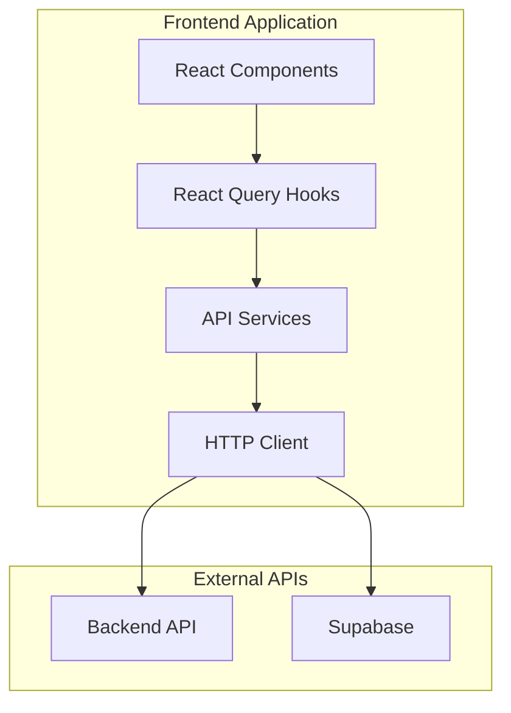

# API Documentation

This directory contains comprehensive documentation for all API integrations, services, and data handling patterns used in the Sunsteel Frontend application.

## Table of Contents

- [Overview](#overview)
- [API Architecture](#api-architecture)
- [Authentication](#authentication)
- [Services](#services)
- [Error Handling](#error-handling)
- [Testing](#testing)

## Overview

The Sunsteel Frontend uses a layered API architecture that separates concerns between different types of data operations:

- **HTTP Client**: Base HTTP client with authentication and error handling
- **Service Layer**: Domain-specific API services (routines, workouts, users)
- **Hook Layer**: React Query hooks for data fetching and mutations
- **Type Layer**: TypeScript definitions for API data structures

## API Architecture

### High-Level Architecture



### Data Flow

1. **Components** request data through React Query hooks
2. **Hooks** call service methods for data operations
3. **Services** use the HTTP client for network requests
4. **HTTP Client** handles authentication, headers, and error responses
5. **Backend/Supabase** processes requests and returns data

## Authentication

All API requests that require authentication use the Supabase session token:

```typescript
// Automatic authentication header injection
const { data: { session } } = await supabase.auth.getSession()
if (session?.access_token) {
  headers.Authorization = `Bearer ${session.access_token}`
}
```

For detailed authentication patterns, see:
- [Authentication Integration](./authentication.md)
- [Session Management](./session-management.md)

## Services

### Available Services

| Service | Description | Documentation |
|---------|-------------|---------------|
| **Routine Service** | Manage workout routines | [routines.md](./services/routines.md) |
| **Workout Service** | Handle workout sessions | [workouts.md](./services/workouts.md) |
| **User Service** | User profile and preferences | [users.md](./services/users.md) |
| **Exercise Service** | Exercise database operations | [exercises.md](./services/exercises.md) |

### Service Pattern

All services follow a consistent pattern:

```typescript
export const serviceNameService = {
  // GET operations
  async getAll(filters?: FilterType): Promise<EntityType[]> { },
  async getById(id: string): Promise<EntityType> { },
  
  // POST operations
  async create(data: CreateEntityType): Promise<EntityType> { },
  
  // PUT/PATCH operations
  async update(id: string, data: Partial<EntityType>): Promise<EntityType> { },
  
  // DELETE operations
  async delete(id: string): Promise<void> { }
}
```

## Error Handling

### Error Types

The API layer handles several types of errors:

- **Network Errors**: Connection issues, timeouts
- **HTTP Errors**: 4xx and 5xx status codes
- **Authentication Errors**: Invalid or expired tokens
- **Validation Errors**: Invalid request data
- **Business Logic Errors**: Application-specific errors

### Error Response Format

```typescript
interface ApiError {
  status: number
  message: string
  code?: string
  details?: Record<string, any>
}
```

For detailed error handling patterns, see:
- [Error Handling Guide](./error-handling.md)
- [HTTP Status Codes](./http-status-codes.md)

## Testing

### Testing Strategy

API services are tested using:

- **Unit Tests**: Individual service method testing
- **Integration Tests**: End-to-end API flow testing
- **Mock Testing**: Mocked responses for predictable testing
- **Error Testing**: Error scenario and edge case testing

### Test Patterns

```typescript
// Service testing example
describe('routineService', () => {
  beforeEach(() => {
    // Setup mocks
    vi.clearAllMocks()
  })
  
  it('should fetch user routines', async () => {
    const mockRoutines = [createMockRoutine()]
    httpClient.get.mockResolvedValue(mockRoutines)
    
    const result = await routineService.getUserRoutines()
    
    expect(result).toEqual(mockRoutines)
    expect(httpClient.get).toHaveBeenCalledWith('/routines', { secure: true })
  })
})
```

For detailed testing patterns, see:
- [API Testing Guide](./testing.md)
- [Mock Strategies](./mocking.md)

## Quick Reference

### Common Endpoints

| Method | Endpoint | Description |
|--------|----------|-------------|
| GET | `/routines` | Get user routines |
| POST | `/routines` | Create new routine |
| GET | `/routines/:id` | Get routine details |
| PUT | `/routines/:id` | Update routine |
| DELETE | `/routines/:id` | Delete routine |
| GET | `/workouts` | Get workout sessions |
| POST | `/workouts` | Start new workout |
| GET | `/exercises` | Get exercise database |

### Authentication Headers

```typescript
// Required for protected endpoints
headers: {
  'Authorization': 'Bearer <supabase_access_token>',
  'Content-Type': 'application/json'
}
```

### Environment Variables

```bash
# Required API configuration
NEXT_PUBLIC_API_URL=http://localhost:4000/api
NEXT_PUBLIC_SUPABASE_URL=your-supabase-url
NEXT_PUBLIC_SUPABASE_ANON_KEY=your-supabase-anon-key
```

## Related Documentation

- [Architecture Overview](../architecture/README.md)
- [Component Documentation](../components/README.md)
- [Hooks Documentation](../hooks/README.md)
- [Development Guidelines](../development/README.md)

---

For specific implementation details, refer to the individual service documentation files in this directory.