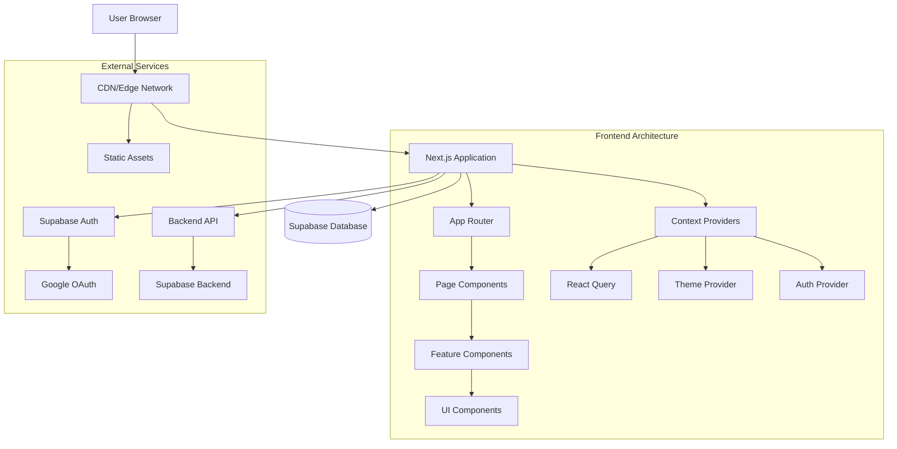
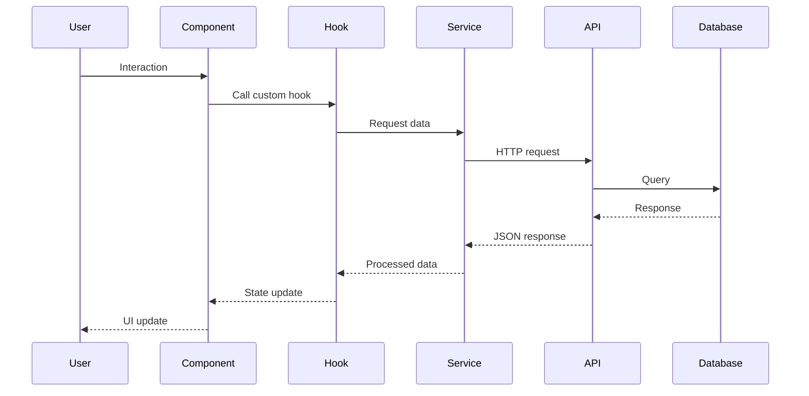
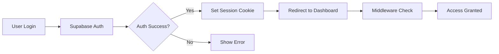
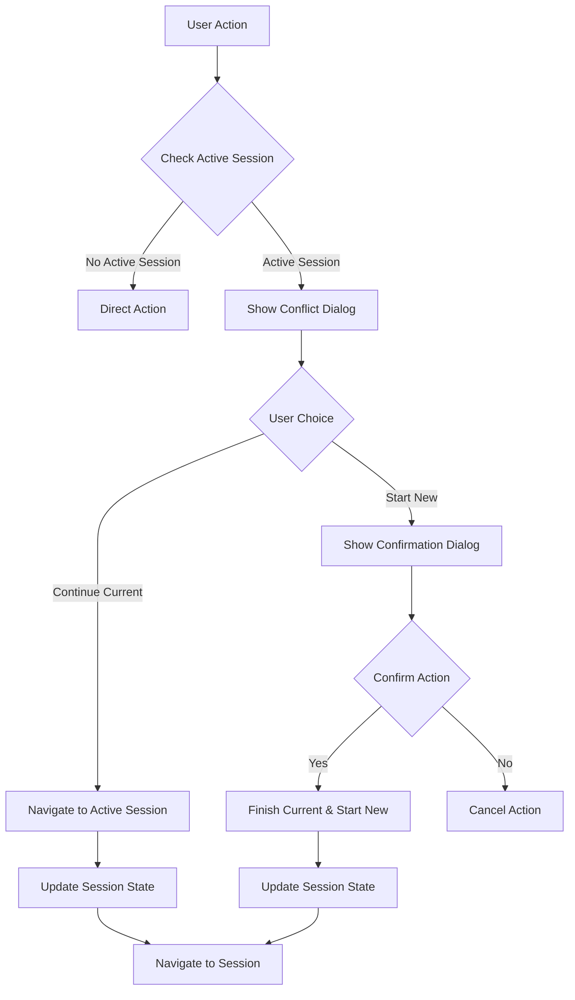
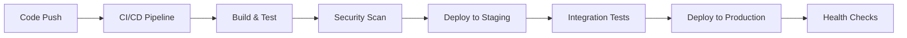

# Architecture Overview

This document provides a comprehensive overview of the Sunsteel Frontend architecture, including system design principles, architectural patterns, and technical decisions.

## Table of Contents

- [System Architecture](#system-architecture)
- [Architectural Principles](#architectural-principles)
- [Technology Stack](#technology-stack)
- [Directory Structure](#directory-structure)
- [Data Flow](#data-flow)
- [Authentication Architecture](#authentication-architecture)
- [State Management](#state-management)
- [Routing Strategy](#routing-strategy)
- [Performance Architecture](#performance-architecture)
- [Security Architecture](#security-architecture)
- [Testing Architecture](#testing-architecture)
- [Deployment Architecture](#deployment-architecture)

## System Architecture

### High-Level Overview



### Core Components

1. **Presentation Layer**: React components and UI logic
2. **Business Logic Layer**: Custom hooks and feature logic
3. **Data Layer**: API services and React Query
4. **Infrastructure Layer**: Providers and configuration

## Architectural Principles

### 1. Feature-Driven Architecture

- **Domain Organization**: Group related functionality by business domain
- **Encapsulation**: Keep feature-specific logic contained within feature directories
- **Reusability**: Extract common patterns into shared utilities

```
features/
├── routines/           # Routine management domain
│   ├── components/     # Feature-specific components
│   ├── hooks/         # Feature-specific hooks
│   └── services/      # Feature-specific API services
└── workouts/          # Workout domain
    ├── components/
    ├── hooks/
    └── services/
```

### 2. Separation of Concerns

- **Components**: Pure presentation logic, minimal business logic
- **Hooks**: Encapsulate stateful logic and side effects
- **Services**: Handle API communication and data transformation
- **Types**: Centralized type definitions for consistency

### 3. Composition Over Inheritance

- **Component Composition**: Build complex UIs from simple components
- **Hook Composition**: Combine multiple hooks for complex behavior
- **Provider Composition**: Layer context providers for different concerns

### 4. Progressive Enhancement

- **Server-First**: Leverage Next.js Server Components by default
- **Client Hydration**: Add interactivity where needed
- **Graceful Degradation**: Ensure functionality without JavaScript

## Technology Stack

### Core Framework

```typescript
// Next.js 15 with App Router
"next": "15.4.6"
"react": "18.3.1"
"typescript": "5"
```

### State Management

```typescript
// Server State
"@tanstack/react-query": "5.85.3"

// Client State
"react": "18.3.1" // Built-in useState, useContext

// Form State
"react-hook-form": "7.55.0"
"@hookform/resolvers": "latest"
"zod": "latest"
```

### Styling

```typescript
// Styling System
"tailwindcss": "4.0.0"
"@tailwindcss/typography": "latest"

// Component Library
"@radix-ui/react-*": "latest" // Primitive components
"class-variance-authority": "latest" // Variant management
"clsx": "latest" // Conditional classes
```

### Authentication & Backend

```typescript
// Authentication
"@supabase/supabase-js": "latest"

// HTTP Client
// Custom implementation with authentication
```

## Directory Structure

### Application Structure

```
app/                           # Next.js App Router
├── layout.tsx                 # Root layout with providers
├── page.tsx                   # Landing page
├── (auth)/                    # Authentication routes (route group)
│   ├── layout.tsx             # Auth-specific layout
│   ├── login/page.tsx         # Login page
│   ├── signup/page.tsx        # Registration page
│   └── auth/callback/page.tsx # OAuth callback
└── (protected)/               # Authenticated routes (route group)
    ├── layout.tsx             # Protected shell layout
    ├── dashboard/page.tsx     # Main dashboard
    ├── routines/              # Routine management
    │   ├── page.tsx           # Routines list
    │   ├── [id]/page.tsx      # Routine details
    │   └── create/page.tsx    # Create routine
    └── workouts/              # Workout sessions
        ├── page.tsx           # Workouts list
        └── [id]/page.tsx      # Workout session
```

### Component Architecture

```
components/
├── ui/                        # Base UI components (Shadcn/ui)
│   ├── button.tsx             # Button primitive
│   ├── input.tsx              # Input primitive
│   └── ...                    # Other primitives
├── backgrounds/               # Classical theme components
│   ├── GoldVignetteOverlay.tsx
│   └── ParchmentOverlay.tsx
└── layout/                    # Layout components
    └── HeroSection.tsx
```

### Feature Architecture

```
features/
├── routines/                  # Routine management feature
│   ├── components/            # Feature-specific components
│   │   ├── RoutineCard.tsx    # Routine display component
│   │   ├── RoutineWizard.tsx  # Multi-step creation
│   │   └── RoutinesList.tsx   # List with filtering
│   ├── hooks/                 # Feature-specific hooks
│   │   ├── useRoutines.ts     # Data fetching
│   │   └── useRoutineActions.ts # CRUD operations
│   └── services/              # API services
│       └── routineService.ts  # HTTP operations
└── shell/                     # Application shell
    └── components/
        ├── Sidebar.tsx        # Navigation sidebar
        └── Header.tsx         # Application header
```

## Data Flow

### Request Flow Architecture



### State Flow Patterns

1. **Server State Flow**:
   ```typescript
   // React Query manages server state
   const { data, isLoading, error } = useQuery({
     queryKey: ['routines', filters],
     queryFn: () => routineService.getUserRoutines(filters)
   })
   ```

2. **Client State Flow**:
   ```typescript
   // Local component state
   const [isOpen, setIsOpen] = useState(false)
   
   // Global client state via Context
   const { theme, setTheme } = useTheme()
   ```

3. **Form State Flow**:
   ```typescript
   // React Hook Form manages form state
   const form = useForm<FormData>({
     resolver: zodResolver(schema)
   })
   ```

## Authentication Architecture

### Authentication Flow



### Session Management

1. **Client-Side Session**:
   ```typescript
   // Client-side session indicator
   document.cookie = `has_session=true; path=/; max-age=${7 * 24 * 60 * 60}`
   ```

2. **Server-Side Session**:
   ```typescript
   // HttpOnly secure session cookie
   response.cookies.set('ss_session', sessionData, {
     httpOnly: true,
     secure: true,
     sameSite: 'lax',
     maxAge: 7 * 24 * 60 * 60 * 1000
   })
   ```

3. **Middleware Protection**:
   ```typescript
   // Route protection at middleware level
   export function middleware(request: NextRequest) {
     const hasSession = request.cookies.get('has_session')
     
     if (!hasSession && isProtectedRoute(request.nextUrl.pathname)) {
       return NextResponse.redirect(new URL('/login', request.url))
     }
   }
   ```

## State Management

### State Architecture Layers

1. **Server State** (React Query):
   - API data caching
   - Background refetching
   - Optimistic updates
   - Error handling

2. **Client State** (React Context):
   - Theme preferences
   - UI state (modals, sidebars)
   - User preferences

3. **Form State** (React Hook Form):
   - Form validation
   - Field state management
   - Submission handling

4. **URL State** (Next.js Router):
   - Route parameters
   - Query parameters
   - Navigation state

### State Management Patterns

```typescript
// Server State Pattern
export const useRoutines = (filters?: RoutineFilters) => {
  return useQuery({
    queryKey: ['routines', serializeFilters(filters)],
    queryFn: () => routineService.getUserRoutines(filters),
    staleTime: 5 * 60 * 1000, // 5 minutes
  })
}

// Client State Pattern
const ThemeContext = createContext<ThemeContextType | undefined>(undefined)

export const useTheme = () => {
  const context = useContext(ThemeContext)
  if (!context) {
    throw new Error('useTheme must be used within ThemeProvider')
  }
  return context
}

// Form State Pattern
const form = useForm<RoutineFormData>({
  resolver: zodResolver(routineSchema),
  defaultValues: {
    name: '',
    description: '',
    trainingDays: []
  }
})
```

## Routing Strategy

### App Router Architecture

```typescript
// Route Groups for Organization
app/
├── (auth)/          # Public authentication routes
├── (protected)/     # Authenticated application routes
└── (marketing)/     # Public marketing pages (future)
```

### Route Protection Strategy

1. **Middleware-Level Protection**:
   ```typescript
   // Global route protection
   export const config = {
     matcher: [
       '/((?!_next/static|_next/image|favicon.ico|.*\\.(?:svg|png|jpg|jpeg|gif|webp)$).*)',
     ],
   }
   ```

2. **Layout-Level Protection**:
   ```typescript
   // Protected layout with auth check
   export default function ProtectedLayout({
     children,
   }: {
     children: React.ReactNode
   }) {
     return (
       <AuthGuard>
         <AppShell>
           {children}
         </AppShell>
       </AuthGuard>
     )
   }
   ```

3. **Component-Level Protection**:
   ```typescript
   // Individual component protection
   const ProtectedComponent = () => {
     const { user, isLoading } = useAuth()
     
     if (isLoading) return <LoadingSkeleton />
     if (!user) return <LoginPrompt />
     
     return <ComponentContent />
   }
   ```

## Performance Architecture

### Optimization Strategies

1. **Code Splitting**:
   ```typescript
   // Route-based splitting (automatic with App Router)
   // Component-based splitting
   const HeavyComponent = dynamic(() => import('./HeavyComponent'), {
     loading: () => <Skeleton />,
     ssr: false
   })
   ```

2. **Caching Strategy**:
   ```typescript
   // React Query caching
   const queryClient = new QueryClient({
     defaultOptions: {
       queries: {
         staleTime: 5 * 60 * 1000,      // 5 minutes
         cacheTime: 10 * 60 * 1000,     // 10 minutes
         retry: 3,
         retryDelay: attemptIndex => Math.min(1000 * 2 ** attemptIndex, 30000)
       }
     }
   })
   ```

3. **Image Optimization**:
   ```typescript
   // Next.js Image component
   import Image from 'next/image'
   
   <Image
     src="/hero-background.webp"
     alt="Classical architecture"
     width={1920}
     height={1080}
     priority
     placeholder="blur"
   />
   ```

### Bundle Optimization

1. **Tree Shaking**: Automatic with Next.js and ES modules
2. **Dynamic Imports**: For heavy components and libraries
3. **Bundle Analysis**: Regular monitoring with `npm run analyze`

## Security Architecture

### Security Layers

1. **Authentication Security**:
   - Supabase JWT tokens
   - HttpOnly session cookies
   - CSRF protection via SameSite cookies

2. **Authorization Security**:
   - Route-level protection
   - API endpoint security
   - Role-based access control (future)

3. **Data Security**:
   - Input validation with Zod schemas
   - SQL injection prevention (Supabase)
   - XSS prevention via React's built-in escaping

4. **Transport Security**:
   - HTTPS enforcement
   - Secure cookie flags
   - Content Security Policy headers

### Security Implementation

```typescript
// Input validation
const routineSchema = z.object({
  name: z.string().min(1).max(100),
  description: z.string().max(500).optional(),
  trainingDays: z.array(z.number().min(0).max(6))
})

// API security
const secureRequest = async (endpoint: string, options: RequestOptions) => {
  const session = await supabase.auth.getSession()
  
  return fetch(endpoint, {
    ...options,
    headers: {
      ...options.headers,
      'Authorization': `Bearer ${session.data.session?.access_token}`,
      'Content-Type': 'application/json'
    }
  })
}
```

## Dialog-to-Navigation Flow Architecture

### Dialog System Overview

The application uses a sophisticated dialog system that integrates seamlessly with navigation patterns to handle complex user interactions, particularly around workout session management and conflict resolution.

### Dialog Flow Patterns



### Core Dialog Components

1. **ActiveSessionConflictDialog**: Handles conflicts when starting new sessions
2. **DateValidationErrorDialog**: Manages date-related validation errors
3. **DateConfirmationDialog**: Confirms date selections and actions

### Navigation Integration Patterns

#### 1. Conflict Resolution Navigation

```typescript
// Active session conflict resolution
const handleActiveSessionConflict = useCallback(async () => {
  const activeSession = await workoutService.getActiveSession()
  
  if (activeSession) {
    // Show conflict dialog with navigation options
    setActiveSessionConflict({
      isOpen: true,
      activeSession,
      onGoToActive: () => {
        router.push(`/workouts/${activeSession.id}`)
        setActiveSessionConflict(prev => ({ ...prev, isOpen: false }))
      },
      onStartNew: () => {
        // Show confirmation dialog for starting new session
        setDateConfirmation({
          isOpen: true,
          onConfirm: async () => {
            await finishSession(activeSession.id, 'CANCELLED')
            await startNewSession()
          }
        })
      }
    })
  }
}, [router, finishSession, startNewSession])
```

#### 2. State Synchronization Navigation

```typescript
// Synchronize navigation with session state
const useWorkoutSessionNavigation = () => {
  const router = useRouter()
  const { data: activeSession } = useQuery({
    queryKey: ['activeSession'],
    queryFn: workoutService.getActiveSession
  })
  
  const navigateToActiveSession = useCallback(() => {
    if (activeSession) {
      router.push(`/workouts/${activeSession.id}`)
    }
  }, [activeSession, router])
  
  return { navigateToActiveSession, hasActiveSession: !!activeSession }
}
```

#### 3. Multi-Route Session Handling

```typescript
// Handle active sessions across multiple routes
const useActiveSessionGuard = (routeName: string) => {
  const { data: activeSession } = useActiveSession()
  const router = useRouter()
  
  useEffect(() => {
    if (activeSession && routeName !== 'workout-session') {
      // Show notification about active session
      toast({
        title: "Active Workout Session",
        description: "You have an active workout session",
        action: (
          <Button 
            onClick={() => router.push(`/workouts/${activeSession.id}`)}
            variant="outline"
          >
            Go to Session
          </Button>
        )
      })
    }
  }, [activeSession, routeName, router])
}
```

### Dialog State Management

#### 1. Compound Dialog State

```typescript
interface WorkoutDialogState {
  activeSessionConflict: {
    isOpen: boolean
    activeSession?: WorkoutSession
    onGoToActive?: () => void
    onStartNew?: () => void
  }
  dateValidationError: {
    isOpen: boolean
    message?: string
    onClose?: () => void
  }
  dateConfirmation: {
    isOpen: boolean
    message?: string
    onConfirm?: () => void
    onCancel?: () => void
  }
}
```

#### 2. Dialog State Synchronization

```typescript
// Synchronize dialog state with navigation
const useDialogNavigation = () => {
  const [dialogState, setDialogState] = useState<WorkoutDialogState>({
    activeSessionConflict: { isOpen: false },
    dateValidationError: { isOpen: false },
    dateConfirmation: { isOpen: false }
  })
  
  const closeAllDialogs = useCallback(() => {
    setDialogState({
      activeSessionConflict: { isOpen: false },
      dateValidationError: { isOpen: false },
      dateConfirmation: { isOpen: false }
    })
  }, [])
  
  // Close dialogs on route change
  useEffect(() => {
    const handleRouteChange = () => closeAllDialogs()
    router.events.on('routeChangeStart', handleRouteChange)
    return () => router.events.off('routeChangeStart', handleRouteChange)
  }, [closeAllDialogs])
  
  return { dialogState, setDialogState, closeAllDialogs }
}
```

### Navigation Flow Optimization

#### 1. Prefetch Active Session Routes

```typescript
// Prefetch likely navigation targets
const usePrefetchActiveSession = () => {
  const router = useRouter()
  const { data: activeSession } = useActiveSession()
  
  useEffect(() => {
    if (activeSession) {
      // Prefetch the active session route
      router.prefetch(`/workouts/${activeSession.id}`)
    }
  }, [activeSession, router])
}
```

#### 2. Optimistic Navigation Updates

```typescript
// Optimistic navigation with rollback
const useOptimisticSessionNavigation = () => {
  const queryClient = useQueryClient()
  const router = useRouter()
  
  const navigateWithOptimisticUpdate = useCallback(async (
    sessionId: string,
    optimisticData: Partial<WorkoutSession>
  ) => {
    // Optimistically update cache
    queryClient.setQueryData(['session', sessionId], optimisticData)
    
    try {
      // Navigate immediately
      await router.push(`/workouts/${sessionId}`)
      
      // Validate with server
      await queryClient.invalidateQueries(['session', sessionId])
    } catch (error) {
      // Rollback on error
      queryClient.invalidateQueries(['session', sessionId])
      throw error
    }
  }, [queryClient, router])
  
  return { navigateWithOptimisticUpdate }
}
```

### Error Handling in Dialog Navigation

#### 1. Navigation Error Recovery

```typescript
// Handle navigation errors in dialog flows
const useDialogNavigationErrorHandler = () => {
  const [error, setError] = useState<string | null>(null)
  
  const handleNavigationError = useCallback((error: Error, context: string) => {
    console.error(`Navigation error in ${context}:`, error)
    
    setError(`Failed to navigate: ${error.message}`)
    
    // Show error dialog
    toast({
      title: "Navigation Error",
      description: error.message,
      variant: "destructive"
    })
  }, [])
  
  return { error, handleNavigationError, clearError: () => setError(null) }
}
```

#### 2. Session State Recovery

```typescript
// Recover from inconsistent session states
const useSessionStateRecovery = () => {
  const queryClient = useQueryClient()
  
  const recoverSessionState = useCallback(async () => {
    try {
      // Force refresh session data
      await queryClient.invalidateQueries(['activeSession'])
      await queryClient.invalidateQueries(['sessions'])
      
      // Verify session consistency
      const activeSession = await workoutService.getActiveSession()
      
      if (!activeSession) {
        // Clear any stale session references
        queryClient.removeQueries(['session'])
      }
    } catch (error) {
      console.error('Session state recovery failed:', error)
    }
  }, [queryClient])
  
  return { recoverSessionState }
}
```

### Performance Considerations

1. **Dialog Lazy Loading**: Load dialog components only when needed
2. **Navigation Prefetching**: Prefetch likely navigation targets
3. **State Debouncing**: Debounce rapid state changes during navigation
4. **Memory Management**: Clean up dialog state on unmount

### Testing Dialog Navigation Flows

```typescript
// Test dialog navigation integration
describe('Dialog Navigation Integration', () => {
  it('should navigate to active session from conflict dialog', async () => {
    const mockActiveSession = createMockSession()
    mockWorkoutService.getActiveSession.mockResolvedValue(mockActiveSession)
    
    render(<WorkoutDialogs {...defaultProps} />)
    
    // Trigger conflict dialog
    fireEvent.click(screen.getByText('Go to Active Session'))
    
    await waitFor(() => {
      expect(mockRouter.push).toHaveBeenCalledWith(`/workouts/${mockActiveSession.id}`)
    })
  })
  
  it('should handle navigation errors gracefully', async () => {
    mockRouter.push.mockRejectedValue(new Error('Navigation failed'))
    
    render(<WorkoutDialogs {...defaultProps} />)
    
    fireEvent.click(screen.getByText('Go to Active Session'))
    
    await waitFor(() => {
      expect(screen.getByText(/navigation error/i)).toBeInTheDocument()
    })
  })
})
```

## Testing Architecture

### Testing Strategy

1. **Unit Tests**: Individual components and utilities
2. **Integration Tests**: Feature workflows and API integration
3. **Dialog Flow Tests**: Dialog-to-navigation integration testing
4. **E2E Tests**: Critical user journeys (future)

### Testing Patterns

```typescript
// Component testing
describe('RoutineCard', () => {
  it('should render routine information', () => {
    const routine = createMockRoutine()
    render(<RoutineCard routine={routine} />)
    
    expect(screen.getByText(routine.name)).toBeInTheDocument()
  })
})

// Hook testing
describe('useRoutines', () => {
  it('should fetch routines successfully', async () => {
    const { result } = renderHook(() => useRoutines(), {
      wrapper: QueryWrapper
    })
    
    await waitFor(() => {
      expect(result.current.isSuccess).toBe(true)
    })
  })
})

// Dialog navigation testing
describe('useDialogNavigation', () => {
  it('should close dialogs on route change', async () => {
    const { result } = renderHook(() => useDialogNavigation())
    
    // Open dialog
    act(() => {
      result.current.setDialogState({
        activeSessionConflict: { isOpen: true },
        dateValidationError: { isOpen: false },
        dateConfirmation: { isOpen: false }
      })
    })
    
    // Simulate route change
    act(() => {
      mockRouter.events.emit('routeChangeStart')
    })
    
    expect(result.current.dialogState.activeSessionConflict.isOpen).toBe(false)
  })
})
```

## Deployment Architecture

### Build Strategy

1. **Static Generation**: For marketing pages
2. **Server-Side Rendering**: For dynamic content
3. **Client-Side Rendering**: For interactive components

### Deployment Pipeline



### Environment Strategy

1. **Development**: Local development with hot reload
2. **Staging**: Production-like environment for testing
3. **Production**: Optimized build with CDN and caching

---

## Related Documentation

- [Data Flow Patterns](./data-flow.md)
- [Routing Configuration](./routing.md)
- [Authentication Flow](./authentication.md)
- [Performance Optimization](./performance.md)
- [Security Implementation](./security.md)
- [Architectural Decision Records](./adrs/README.md)

---

This architecture is designed to be scalable, maintainable, and performant while following modern React and Next.js best practices. For specific implementation details, refer to the individual documentation sections.