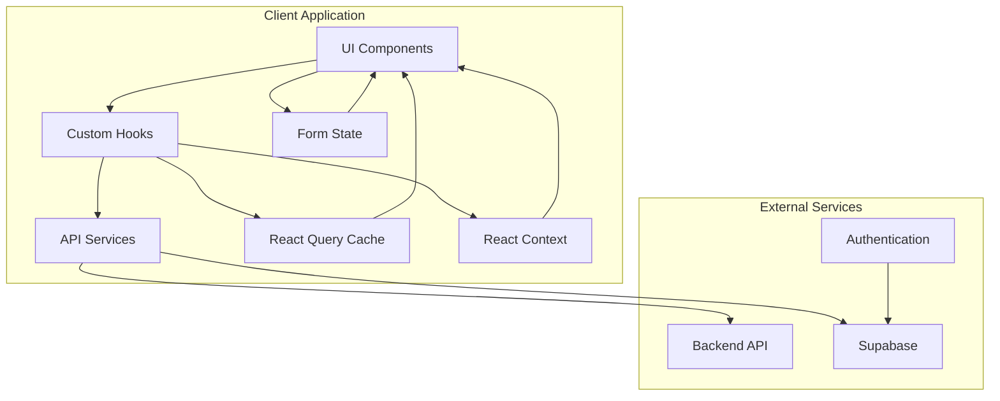

# Data Flow Patterns

This document describes the data flow patterns used throughout the Sunsteel Frontend application, including state management, API integration, and data transformation strategies.

## Table of Contents

- [Overview](#overview)
- [Data Flow Architecture](#data-flow-architecture)
- [Server State Management](#server-state-management)
- [Client State Management](#client-state-management)
- [Form State Management](#form-state-management)
- [Authentication Flow](#authentication-flow)
- [API Integration Patterns](#api-integration-patterns)
- [Caching Strategies](#caching-strategies)
- [Error Handling](#error-handling)
- [Performance Optimizations](#performance-optimizations)

## Overview

The Sunsteel Frontend uses a layered approach to data management, separating concerns between different types of state and data sources:

- **Server State**: API data managed by React Query
- **Client State**: UI state managed by React Context and local state
- **Form State**: Form data managed by React Hook Form
- **URL State**: Route and query parameters managed by Next.js Router

## Data Flow Architecture

### High-Level Data Flow



### Data Flow Layers

1. **Presentation Layer**: React components that display data
2. **Hook Layer**: Custom hooks that manage state and side effects
3. **Service Layer**: API services that handle HTTP requests
4. **Cache Layer**: React Query cache for server state
5. **Context Layer**: React Context for global client state

## Server State Management

### React Query Integration

Server state is managed using React Query (TanStack Query), which provides:

- Automatic caching and background refetching
- Optimistic updates
- Error handling and retry logic
- Loading states and data synchronization

### Query Patterns

#### Basic Query Pattern

```typescript
// Custom hook for fetching routines
export const useRoutines = (filters?: RoutineFilters) => {
  const filterKey = serializeFilters(filters)
  
  return useQuery({
    queryKey: ['routines', filterKey],
    queryFn: () => routineService.getUserRoutines(filters),
    staleTime: 5 * 60 * 1000, // 5 minutes
    cacheTime: 10 * 60 * 1000, // 10 minutes
    retry: 3,
    retryDelay: attemptIndex => Math.min(1000 * 2 ** attemptIndex, 30000)
  })
}

// Usage in component
const RoutinesList = () => {
  const { data: routines, isLoading, error } = useRoutines()
  
  if (isLoading) return <RoutinesSkeletonList />
  if (error) return <ErrorMessage error={error} />
  if (!routines?.length) return <EmptyRoutinesState />
  
  return (
    <div className="grid gap-4">
      {routines.map(routine => (
        <RoutineCard key={routine.id} routine={routine} />
      ))}
    </div>
  )
}
```

#### Mutation Pattern

```typescript
// Custom hook for routine mutations
export const useRoutineMutations = () => {
  const queryClient = useQueryClient()
  
  const createRoutine = useMutation({
    mutationFn: routineService.createRoutine,
    onSuccess: (newRoutine) => {
      // Invalidate and refetch routines
      queryClient.invalidateQueries({ queryKey: ['routines'] })
      
      // Optionally add to cache optimistically
      queryClient.setQueryData(['routines'], (old: Routine[] = []) => [
        ...old,
        newRoutine
      ])
    },
    onError: (error) => {
      toast.error('Failed to create routine')
      console.error('Create routine error:', error)
    }
  })
  
  const updateRoutine = useMutation({
    mutationFn: ({ id, data }: { id: string; data: Partial<Routine> }) =>
      routineService.updateRoutine(id, data),
    onMutate: async ({ id, data }) => {
      // Cancel outgoing refetches
      await queryClient.cancelQueries({ queryKey: ['routines'] })
      
      // Snapshot previous value
      const previousRoutines = queryClient.getQueryData(['routines'])
      
      // Optimistically update
      queryClient.setQueryData(['routines'], (old: Routine[] = []) =>
        old.map(routine => 
          routine.id === id ? { ...routine, ...data } : routine
        )
      )
      
      return { previousRoutines }
    },
    onError: (err, variables, context) => {
      // Rollback on error
      if (context?.previousRoutines) {
        queryClient.setQueryData(['routines'], context.previousRoutines)
      }
    },
    onSettled: () => {
      // Always refetch after error or success
      queryClient.invalidateQueries({ queryKey: ['routines'] })
    }
  })
  
  return {
    createRoutine,
    updateRoutine,
    isCreating: createRoutine.isPending,
    isUpdating: updateRoutine.isPending
  }
}
```

### Query Key Strategies

```typescript
// Centralized query keys
export const queryKeys = {
  routines: {
    all: ['routines'] as const,
    lists: () => [...queryKeys.routines.all, 'list'] as const,
    list: (filters: RoutineFilters) => 
      [...queryKeys.routines.lists(), serializeFilters(filters)] as const,
    details: () => [...queryKeys.routines.all, 'detail'] as const,
    detail: (id: string) => [...queryKeys.routines.details(), id] as const,
  },
  workouts: {
    all: ['workouts'] as const,
    lists: () => [...queryKeys.workouts.all, 'list'] as const,
    list: (routineId: string) => 
      [...queryKeys.workouts.lists(), routineId] as const,
  }
} as const

// Usage with type safety
const { data } = useQuery({
  queryKey: queryKeys.routines.list(filters),
  queryFn: () => routineService.getUserRoutines(filters)
})
```

## Client State Management

### React Context Patterns

Client state is managed using React Context for global state and local component state for component-specific data.

#### Theme Context Example

```typescript
// Theme context definition
interface ThemeContextType {
  theme: 'light' | 'dark'
  setTheme: (theme: 'light' | 'dark') => void
  toggleTheme: () => void
}

const ThemeContext = createContext<ThemeContextType | undefined>(undefined)

// Theme provider implementation
export const ThemeProvider: React.FC<{ children: React.ReactNode }> = ({ 
  children 
}) => {
  const [theme, setTheme] = useState<'light' | 'dark'>('light')
  
  useEffect(() => {
    // Load theme from localStorage
    const savedTheme = localStorage.getItem('theme') as 'light' | 'dark'
    if (savedTheme) {
      setTheme(savedTheme)
    }
  }, [])
  
  useEffect(() => {
    // Save theme to localStorage and apply to document
    localStorage.setItem('theme', theme)
    document.documentElement.classList.toggle('dark', theme === 'dark')
  }, [theme])
  
  const toggleTheme = useCallback(() => {
    setTheme(prev => prev === 'light' ? 'dark' : 'light')
  }, [])
  
  const value = useMemo(() => ({
    theme,
    setTheme,
    toggleTheme
  }), [theme, toggleTheme])
  
  return (
    <ThemeContext.Provider value={value}>
      {children}
    </ThemeContext.Provider>
  )
}

// Custom hook for theme access
export const useTheme = () => {
  const context = useContext(ThemeContext)
  if (!context) {
    throw new Error('useTheme must be used within ThemeProvider')
  }
  return context
}
```

#### Sidebar Context Example

```typescript
// Sidebar state management
interface SidebarContextType {
  isOpen: boolean
  toggle: () => void
  open: () => void
  close: () => void
}

export const useSidebar = () => {
  const [isOpen, setIsOpen] = useState(false)
  
  const toggle = useCallback(() => setIsOpen(prev => !prev), [])
  const open = useCallback(() => setIsOpen(true), [])
  const close = useCallback(() => setIsOpen(false), [])
  
  // Close sidebar on route change
  const pathname = usePathname()
  useEffect(() => {
    setIsOpen(false)
  }, [pathname])
  
  return {
    isOpen,
    toggle,
    open,
    close
  }
}
```

## Form State Management

### React Hook Form Integration

Forms are managed using React Hook Form with Zod validation for type safety and validation.

#### Form Pattern Example

```typescript
// Zod schema definition
const routineFormSchema = z.object({
  name: z.string().min(1, 'Name is required').max(100, 'Name too long'),
  description: z.string().max(500, 'Description too long').optional(),
  trainingDays: z.array(z.number().min(0).max(6)).min(1, 'Select at least one day'),
  exercises: z.array(z.object({
    id: z.string(),
    name: z.string().min(1, 'Exercise name required'),
    sets: z.number().min(1).max(10),
    reps: z.number().min(1).max(100)
  })).min(1, 'Add at least one exercise')
})

type RoutineFormData = z.infer<typeof routineFormSchema>

// Form component
export const RoutineForm: React.FC<{
  initialData?: Partial<RoutineFormData>
  onSubmit: (data: RoutineFormData) => Promise<void>
}> = ({ initialData, onSubmit }) => {
  const form = useForm<RoutineFormData>({
    resolver: zodResolver(routineFormSchema),
    defaultValues: {
      name: '',
      description: '',
      trainingDays: [],
      exercises: [],
      ...initialData
    }
  })
  
  const { handleSubmit, formState: { errors, isSubmitting } } = form
  
  const onFormSubmit = async (data: RoutineFormData) => {
    try {
      await onSubmit(data)
      toast.success('Routine saved successfully')
    } catch (error) {
      toast.error('Failed to save routine')
      console.error('Form submission error:', error)
    }
  }
  
  return (
    <Form {...form}>
      <form onSubmit={handleSubmit(onFormSubmit)} className="space-y-6">
        <FormField
          control={form.control}
          name="name"
          render={({ field }) => (
            <FormItem>
              <FormLabel>Routine Name</FormLabel>
              <FormControl>
                <Input placeholder="Enter routine name" {...field} />
              </FormControl>
              <FormMessage />
            </FormItem>
          )}
        />
        
        <FormField
          control={form.control}
          name="description"
          render={({ field }) => (
            <FormItem>
              <FormLabel>Description</FormLabel>
              <FormControl>
                <Textarea 
                  placeholder="Describe your routine..."
                  {...field}
                />
              </FormControl>
              <FormMessage />
            </FormItem>
          )}
        />
        
        <Button type="submit" disabled={isSubmitting}>
          {isSubmitting ? 'Saving...' : 'Save Routine'}
        </Button>
      </form>
    </Form>
  )
}
```

### Form State Patterns

#### Multi-Step Form Pattern

```typescript
// Multi-step form with state management
export const useRoutineWizard = () => {
  const [currentStep, setCurrentStep] = useState(0)
  const [formData, setFormData] = useState<Partial<RoutineFormData>>({})
  
  const steps = [
    { id: 'basic', title: 'Basic Information' },
    { id: 'schedule', title: 'Training Schedule' },
    { id: 'exercises', title: 'Exercises' },
    { id: 'review', title: 'Review' }
  ]
  
  const nextStep = useCallback(() => {
    setCurrentStep(prev => Math.min(prev + 1, steps.length - 1))
  }, [steps.length])
  
  const prevStep = useCallback(() => {
    setCurrentStep(prev => Math.max(prev - 1, 0))
  }, [])
  
  const updateFormData = useCallback((data: Partial<RoutineFormData>) => {
    setFormData(prev => ({ ...prev, ...data }))
  }, [])
  
  const resetWizard = useCallback(() => {
    setCurrentStep(0)
    setFormData({})
  }, [])
  
  return {
    currentStep,
    steps,
    formData,
    nextStep,
    prevStep,
    updateFormData,
    resetWizard,
    isFirstStep: currentStep === 0,
    isLastStep: currentStep === steps.length - 1
  }
}
```

## Authentication Flow

### Authentication State Management

```typescript
// Authentication context
interface AuthContextType {
  user: User | null
  session: Session | null
  isLoading: boolean
  signIn: (email: string, password: string) => Promise<void>
  signUp: (email: string, password: string) => Promise<void>
  signOut: () => Promise<void>
  signInWithGoogle: () => Promise<void>
}

export const AuthProvider: React.FC<{ children: React.ReactNode }> = ({ 
  children 
}) => {
  const [user, setUser] = useState<User | null>(null)
  const [session, setSession] = useState<Session | null>(null)
  const [isLoading, setIsLoading] = useState(true)
  
  useEffect(() => {
    // Get initial session
    supabase.auth.getSession().then(({ data: { session } }) => {
      setSession(session)
      setUser(session?.user ?? null)
      setIsLoading(false)
    })
    
    // Listen for auth changes
    const {
      data: { subscription },
    } = supabase.auth.onAuthStateChange((_event, session) => {
      setSession(session)
      setUser(session?.user ?? null)
      setIsLoading(false)
    })
    
    return () => subscription.unsubscribe()
  }, [])
  
  const signIn = async (email: string, password: string) => {
    const { error } = await supabase.auth.signInWithPassword({
      email,
      password
    })
    if (error) throw error
  }
  
  const signOut = async () => {
    const { error } = await supabase.auth.signOut()
    if (error) throw error
  }
  
  const value = {
    user,
    session,
    isLoading,
    signIn,
    signUp,
    signOut,
    signInWithGoogle
  }
  
  return (
    <AuthContext.Provider value={value}>
      {children}
    </AuthContext.Provider>
  )
}
```

## API Integration Patterns

### Service Layer Architecture

```typescript
// Base HTTP client
class HttpClient {
  private baseURL: string
  
  constructor(baseURL: string) {
    this.baseURL = baseURL
  }
  
  async request<T>(
    endpoint: string,
    options: RequestInit & { secure?: boolean } = {}
  ): Promise<T> {
    const { secure, ...fetchOptions } = options
    
    const headers: HeadersInit = {
      'Content-Type': 'application/json',
      ...fetchOptions.headers
    }
    
    if (secure) {
      const session = await supabase.auth.getSession()
      if (session.data.session?.access_token) {
        headers.Authorization = `Bearer ${session.data.session.access_token}`
      }
    }
    
    const response = await fetch(`${this.baseURL}${endpoint}`, {
      ...fetchOptions,
      headers
    })
    
    if (!response.ok) {
      throw new ApiError(response.status, await response.text())
    }
    
    return response.json()
  }
  
  get<T>(endpoint: string, options?: RequestInit & { secure?: boolean }) {
    return this.request<T>(endpoint, { ...options, method: 'GET' })
  }
  
  post<T>(endpoint: string, data?: any, options?: RequestInit & { secure?: boolean }) {
    return this.request<T>(endpoint, {
      ...options,
      method: 'POST',
      body: JSON.stringify(data)
    })
  }
  
  put<T>(endpoint: string, data?: any, options?: RequestInit & { secure?: boolean }) {
    return this.request<T>(endpoint, {
      ...options,
      method: 'PUT',
      body: JSON.stringify(data)
    })
  }
  
  delete<T>(endpoint: string, options?: RequestInit & { secure?: boolean }) {
    return this.request<T>(endpoint, { ...options, method: 'DELETE' })
  }
}

export const httpClient = new HttpClient(process.env.NEXT_PUBLIC_API_URL!)
```

### Service Implementation

```typescript
// Routine service
export const routineService = {
  async getUserRoutines(filters?: RoutineFilters): Promise<Routine[]> {
    const params = new URLSearchParams()
    
    if (filters?.search) {
      params.append('search', filters.search)
    }
    if (filters?.category) {
      params.append('category', filters.category)
    }
    if (filters?.isFavorite !== undefined) {
      params.append('favorite', filters.isFavorite.toString())
    }
    
    const query = params.toString()
    const endpoint = `/routines${query ? `?${query}` : ''}`
    
    return httpClient.get<Routine[]>(endpoint, { secure: true })
  },
  
  async getRoutineById(id: string): Promise<Routine> {
    return httpClient.get<Routine>(`/routines/${id}`, { secure: true })
  },
  
  async createRoutine(data: CreateRoutineData): Promise<Routine> {
    return httpClient.post<Routine>('/routines', data, { secure: true })
  },
  
  async updateRoutine(id: string, data: Partial<Routine>): Promise<Routine> {
    return httpClient.put<Routine>(`/routines/${id}`, data, { secure: true })
  },
  
  async deleteRoutine(id: string): Promise<void> {
    return httpClient.delete<void>(`/routines/${id}`, { secure: true })
  },
  
  async toggleFavorite(id: string, isFavorite: boolean): Promise<Routine> {
    return httpClient.patch<Routine>(
      `/routines/${id}/favorite`,
      { isFavorite },
      { secure: true }
    )
  }
}
```

## Caching Strategies

### React Query Caching

```typescript
// Query client configuration
export const queryClient = new QueryClient({
  defaultOptions: {
    queries: {
      staleTime: 5 * 60 * 1000, // 5 minutes
      cacheTime: 10 * 60 * 1000, // 10 minutes
      retry: (failureCount, error) => {
        // Don't retry on 4xx errors
        if (error instanceof ApiError && error.status >= 400 && error.status < 500) {
          return false
        }
        return failureCount < 3
      },
      retryDelay: attemptIndex => Math.min(1000 * 2 ** attemptIndex, 30000)
    },
    mutations: {
      retry: 1,
      retryDelay: 1000
    }
  }
})

// Cache invalidation patterns
export const invalidateRoutines = () => {
  queryClient.invalidateQueries({ queryKey: ['routines'] })
}

export const invalidateRoutine = (id: string) => {
  queryClient.invalidateQueries({ queryKey: ['routines', 'detail', id] })
}

// Prefetching patterns
export const prefetchRoutine = (id: string) => {
  queryClient.prefetchQuery({
    queryKey: ['routines', 'detail', id],
    queryFn: () => routineService.getRoutineById(id),
    staleTime: 5 * 60 * 1000
  })
}
```

### Browser Caching

```typescript
// Service worker caching (future implementation)
// Cache API responses for offline functionality
const CACHE_NAME = 'sunsteel-api-v1'

self.addEventListener('fetch', (event) => {
  if (event.request.url.includes('/api/')) {
    event.respondWith(
      caches.open(CACHE_NAME).then(cache => {
        return cache.match(event.request).then(response => {
          if (response) {
            // Return cached response
            return response
          }
          
          // Fetch and cache new response
          return fetch(event.request).then(response => {
            cache.put(event.request, response.clone())
            return response
          })
        })
      })
    )
  }
})
```

## Error Handling

### Error Boundary Pattern

```typescript
// Global error boundary
interface ErrorBoundaryState {
  hasError: boolean
  error?: Error
}

export class ErrorBoundary extends Component<
  { children: React.ReactNode },
  ErrorBoundaryState
> {
  constructor(props: { children: React.ReactNode }) {
    super(props)
    this.state = { hasError: false }
  }
  
  static getDerivedStateFromError(error: Error): ErrorBoundaryState {
    return { hasError: true, error }
  }
  
  componentDidCatch(error: Error, errorInfo: ErrorInfo) {
    console.error('Error boundary caught an error:', error, errorInfo)
    
    // Log to error reporting service
    // errorReportingService.captureException(error, errorInfo)
  }
  
  render() {
    if (this.state.hasError) {
      return (
        <div className="min-h-screen flex items-center justify-center">
          <div className="text-center">
            <h2 className="text-2xl font-bold mb-4">Something went wrong</h2>
            <p className="text-muted-foreground mb-4">
              We're sorry, but something unexpected happened.
            </p>
            <Button onClick={() => window.location.reload()}>
              Reload Page
            </Button>
          </div>
        </div>
      )
    }
    
    return this.props.children
  }
}
```

### API Error Handling

```typescript
// Custom error classes
export class ApiError extends Error {
  constructor(
    public status: number,
    message: string,
    public response?: any
  ) {
    super(message)
    this.name = 'ApiError'
  }
}

// Error handling in hooks
export const useErrorHandler = () => {
  const handleError = useCallback((error: unknown) => {
    if (error instanceof ApiError) {
      switch (error.status) {
        case 401:
          toast.error('Please log in to continue')
          // Redirect to login
          break
        case 403:
          toast.error('You don\'t have permission to perform this action')
          break
        case 404:
          toast.error('The requested resource was not found')
          break
        case 500:
          toast.error('Server error. Please try again later.')
          break
        default:
          toast.error('An unexpected error occurred')
      }
    } else {
      toast.error('An unexpected error occurred')
      console.error('Unexpected error:', error)
    }
  }, [])
  
  return { handleError }
}
```

## Performance Optimizations

### Data Fetching Optimizations

```typescript
// Parallel data fetching
export const useRoutineDetails = (id: string) => {
  const routineQuery = useQuery({
    queryKey: ['routines', 'detail', id],
    queryFn: () => routineService.getRoutineById(id)
  })
  
  const workoutsQuery = useQuery({
    queryKey: ['workouts', 'list', id],
    queryFn: () => workoutService.getWorkoutsByRoutine(id),
    enabled: !!routineQuery.data // Only fetch when routine is loaded
  })
  
  return {
    routine: routineQuery.data,
    workouts: workoutsQuery.data,
    isLoading: routineQuery.isLoading || workoutsQuery.isLoading,
    error: routineQuery.error || workoutsQuery.error
  }
}

// Infinite queries for large datasets
export const useInfiniteRoutines = (filters?: RoutineFilters) => {
  return useInfiniteQuery({
    queryKey: ['routines', 'infinite', serializeFilters(filters)],
    queryFn: ({ pageParam = 0 }) =>
      routineService.getRoutinesPaginated(filters, pageParam),
    getNextPageParam: (lastPage, pages) => {
      return lastPage.hasMore ? pages.length : undefined
    },
    staleTime: 5 * 60 * 1000
  })
}
```

### Memoization Patterns

```typescript
// Component memoization
export const RoutineCard = React.memo<RoutineCardProps>(({ routine, onToggleFavorite }) => {
  const handleFavoriteClick = useCallback(() => {
    onToggleFavorite(routine.id, !routine.isFavorite)
  }, [routine.id, routine.isFavorite, onToggleFavorite])
  
  return (
    <Card>
      <CardHeader>
        <CardTitle>{routine.name}</CardTitle>
      </CardHeader>
      <CardContent>
        <p>{routine.description}</p>
      </CardContent>
      <CardFooter>
        <Button
          variant="ghost"
          size="sm"
          onClick={handleFavoriteClick}
        >
          {routine.isFavorite ? '❤️' : '🤍'}
        </Button>
      </CardFooter>
    </Card>
  )
})

// Expensive computation memoization
export const useRoutineStats = (routines: Routine[]) => {
  return useMemo(() => {
    const totalRoutines = routines.length
    const favoriteRoutines = routines.filter(r => r.isFavorite).length
    const categoryCounts = routines.reduce((acc, routine) => {
      acc[routine.category] = (acc[routine.category] || 0) + 1
      return acc
    }, {} as Record<string, number>)
    
    return {
      totalRoutines,
      favoriteRoutines,
      categoryCounts
    }
  }, [routines])
}
```

---

This data flow architecture ensures efficient, predictable, and maintainable data management throughout the Sunsteel Frontend application. For implementation details, refer to the specific service and hook files in the codebase.